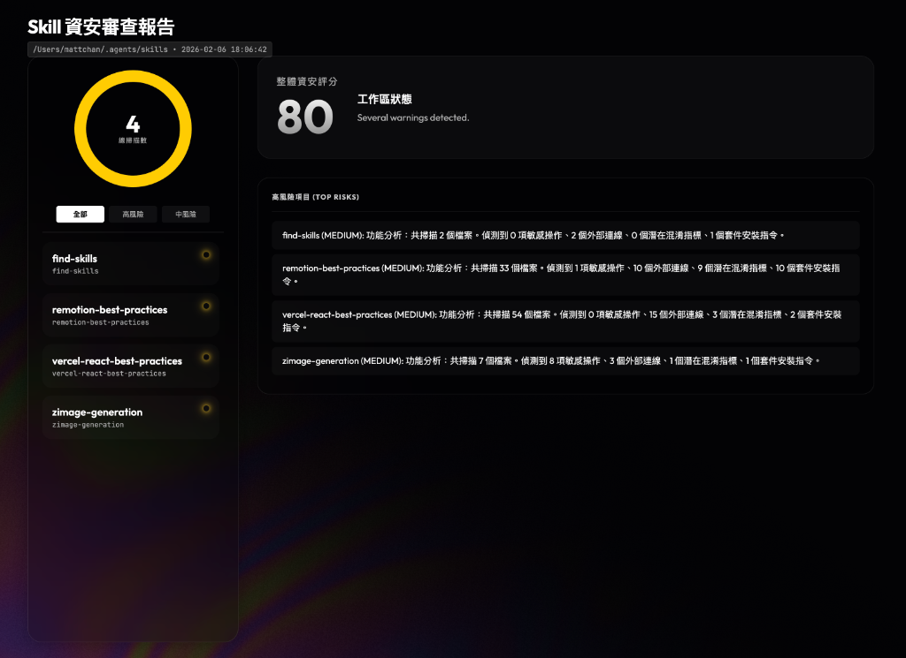

# 🛡️ Skills-Security-Check

> GitHub source: https://github.com/Toolsai/Skills-Security-Check

A hybrid AI-powered security auditing tool for scanning skill directories and generating visual security dashboards.

一款結合 AI 智慧分析的混合式安全審查工具，用於掃描技能目錄並生成視覺化安全儀表板。


## 📸 Dashboard Preview | 儀表板預覽



## 📖 Overview | 概述

**Skills-Security-Check** is a security scanning tool designed for AI Agent skill repositories. It combines:

**Skills-Security-Check** 是一款專為 AI Agent 技能倉庫設計的安全掃描工具，結合了：

1. **Static Analysis | 靜態分析** - Regex-based pattern matching to identify potential risks | 使用正則表達式匹配潛在風險
2. **AI Intelligence | AI 智慧分析** - Leverages AI agents to analyze findings and reduce false positives | 利用 AI 代理分析發現並減少誤報
3. **Visual Dashboard | 視覺化儀表板** - Generates a beautiful, interactive HTML dashboard | 生成精美的互動式 HTML 儀表板

### What It Detects | 偵測項目

| Category | 類別 | Examples | 範例 |
|----------|------|----------|------|
| 🔑 **Sensitive Operations** | 敏感操作 | API keys, credentials, environment variables | API 金鑰、憑證、環境變數 |
| 🌐 **Network Activity** | 網路活動 | External URLs, IP addresses, API endpoints | 外部連結、IP 位址、API 端點 |
| 🎭 **Obfuscation Signals** | 混淆跡象 | Base64 encoding, eval(), dynamic imports | Base64 編碼、eval()、動態載入 |
| 📦 **Package Installs** | 套件安裝 | npm, pip, apt, brew, yarn, pnpm, gem, go | npm, pip, apt, brew 等安裝指令 |
| ⚠️ **High-Risk Patterns** | 高風險模式 | Shell execution, download-and-execute | Shell 執行、下載並執行 |

---

## 🚀 Quick Start | 快速開始

### Prerequisites | 前置需求
- Python 3.8+
- No external dependencies required (uses standard library only)
- 無需外部依賴（僅使用 Python 標準函式庫）

### Installation | 安裝

```bash
# Clone the repository | 複製專案
git clone https://github.com/YOUR_USERNAME/Skills-Security-Check.git

# Navigate to the skill directory | 進入技能目錄
cd Skills-Security-Check
```

### Usage | 使用方式

```bash
# Scan a directory of skills | 掃描技能目錄
python3 scripts/scan_skills.py --root /path/to/your/skills

# The dashboard will auto-open in your browser
# 儀表板將自動在瀏覽器中開啟
```

### Output Structure | 輸出結構

```
reports/YYYYMMDD_HHMMSS/
├── index.html          # Interactive dashboard | 互動式儀表板
├── data.json           # Raw scan data | 原始掃描資料
└── prompts/            # AI audit prompts | AI 審查提示詞
    ├── skill1_audit_prompt.txt
    └── skill2_audit_prompt.txt
```

---

## 🤖 AI-Powered Workflow | AI 驅動工作流程

This skill is designed to work with AI agents. The recommended workflow:

此技能專為 AI 代理設計，建議的工作流程如下：

1. **Run Scanner | 執行掃描** → Generates raw findings and audit prompts | 生成原始發現與審查提示詞
2. **AI Analysis | AI 分析** → Agent reads prompts and creates `audit.json` for each skill | 代理讀取提示詞並為每個技能建立 `audit.json`
3. **Integrate & Present | 整合呈現** → Re-run scanner to merge AI insights into final report | 重新執行掃描器以合併 AI 洞察至最終報告

See [SKILL.md](SKILL.md) for detailed agent instructions.

詳細的代理指示請參閱 [SKILL.md](SKILL.md)。

---

## 📊 Dashboard Features | 儀表板功能

- **Executive Summary | 總覽摘要** - Overall security score and top risks at a glance | 一目了然的安全評分與高風險項目
- **Risk Filtering | 風險篩選** - Filter by High/Medium/Low risk levels | 依高/中/低風險等級篩選
- **Detailed Views | 詳細檢視** - Click any skill to see full breakdown | 點擊任何技能查看完整分析
- **AI Insights Card | AI 洞察卡片** - Displays AI-generated analysis when available | 顯示 AI 生成的分析結果
- **Responsive Design | 響應式設計** - Works on desktop and tablet | 支援桌面與平板裝置

---

## 🔧 Configuration | 設定

### Command Line Arguments | 命令列參數

| Argument | 參數 | Description | 說明 | Default | 預設值 |
|----------|------|-------------|------|---------|--------|
| `--root` | | Root directory containing skills to scan | 包含待掃描技能的根目錄 | Current directory | 當前目錄 |
| `--out` | | Custom output path for HTML report | 自訂 HTML 報告輸出路徑 | Auto-generated | 自動生成 |

---

## 📁 Project Structure | 專案結構

```
Skills-Security-Check/
├── SKILL.md                    # AI agent instructions | AI 代理指示
├── README.md                   # This file | 本檔案
├── scripts/
│   └── scan_skills.py          # Main scanner script | 主掃描腳本
├── assets/
│   └── dashboard_template.html # Dashboard HTML template | 儀表板 HTML 模板
└── reports/                    # Generated reports | 生成的報告 (gitignored)
```

---

## 🤝 Contributing | 貢獻

Contributions are welcome! Please feel free to submit a Pull Request.

歡迎貢獻！請隨時提交 Pull Request。

---

## 👤 Author | 作者

**Prompt Case**

[](https://www.threads.com/@prompt_case)
[](https://www.patreon.com/MattTrendsPromptEngineering)

- 🧵 Threads: [@prompt_case](https://www.threads.com/@prompt_case)
- 💖 Patreon: [MattTrendsPromptEngineering](https://www.patreon.com/MattTrendsPromptEngineering)

---

## 📄 License | 授權

This project is licensed under the MIT License.

本專案採用 MIT 授權條款。

## 🙏 Acknowledgments | 致謝

Built with ❤️ for the AI Agent ecosystem.

為 AI Agent 生態系統用心打造 ❤️
